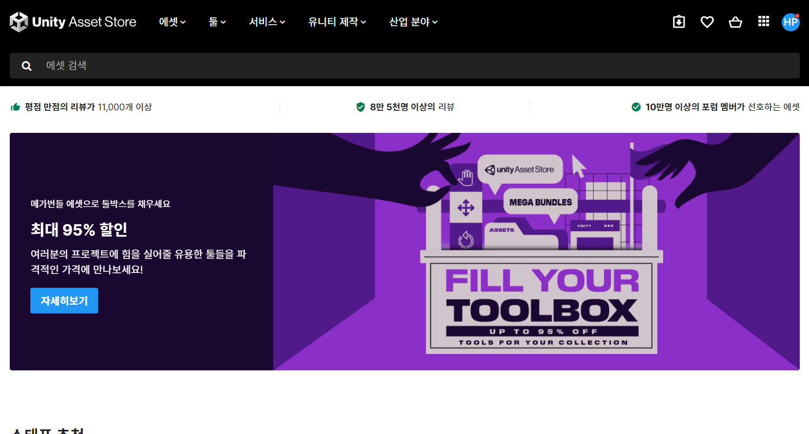

# 21/10/13 Unity 특강 1

## 0. Real-time Engine

애니메이션, 디자인 또는 그래픽과 같은 시각화를 즉시 생성할 수 있게 해주는 도구이다. 리얼 타임 엔진이 필요한 이유는 크게 두가지이다. 

1. 제품 제작 전 디자인 오류를 줄이기 위해 실시간 렌더링이 중요하기 때문이다. 예를들어 자동차 회사에서 제품을 만들 때, 결과물이 마음에 들지 않을 때 매번 새로운 차를 만들 수 없을 것이다.
2. 몰입형 기술로 제품 디자인을 경험 해보는 것이 디자인 프로세스에 중요하기 때문이다.

이런 이유로 게임, 디자인, 제조, 건축, 가상현실, 증강현실, 교육, 회의, 영화 등 다양한 사업에서 리얼타임 엔진이 많이 사용되고 있다.

Real-time Engine이 사용되는 대표적인 사례를 소개하도록 하겠다.

- 아우디 디지털 쇼룸
  

  [영상 보기](https://youtu.be/QY2s_Fnsj5c)

  Real-time engine을 사용하여 진짜처럼 제품을 만들어 확인할 수 있다. 휠과 전체적인 차의 모습, 색깔 등을 볼 수 있는 것이다. 또한 물리법칙도 구현이 가능해서 마찰계수, 가속도 등을 확인해 볼 수 있다.

  

- 할리우드 VR 체험
  

  [영상 확인](https://youtu.be/KJRZTkttgLw)

  엠비디아에서 고성능 그래픽 카드를 사용하여 시네마틱씬 렌더링을 구현했다. 영상의 모든 장면이  Real-time engine을 사용하여 렌더링을 한 것이다. 이렇게 Real-time engine은 할리우드에서 영화를 만들때도 사용하는 것을 확인할 수 있다.

  

- 아키텍처 렌더링

  

  [영상 보기](https://youtu.be/A1eP4CybdZ0)

  건축이나 인테리어 디자인 산업에서 시각화를 할 때 역시 Real-time engine을 사용한 3D 렌더링을 적극 이용하고 있다.

특히 방의 인테리어를 가상으로 맞춰 보여주는 기술은 이케아에서 유명하게 사용되고 있다. 이외에도 교육업계, 게임등에서 많이 사용되고 있다.

모든 장면을 하나하나 배치하고 질감, 위치 등을 직접 그리고 씌우는 등의 작업을 하는 오프라인 렌더링과 다르게, 리얼타임 렌더링은 툴을 사용하여 실시간으로 조정을 하며 이미지나 영상을 완성하는 것이다. 그렇다 보니 오프라인 렌더링보다 훨씬 빠른 속도로 작업물이 완성된다.

---

Real-time engine은 크게 `Unreal Engine`과 `Unity Engine` , 이렇게 두 가지로 나뉜다.

1. Unreal은 실감 있는 Real-time 3D(RT3D) 개발 환경을 제공하는 통합형 게임 엔진이다. 배틀그라운드에서 사용하고 있다.
2. Unity는 전세계에서 가장 널리, 많이 사용되는 Real-time 3D(RT3D) 개발 플렛폼이다.

이제 이 두 엔진을 비교해보도록 하겠다.

### 01 - Unreal Engine

- 개발 언어: C++(객체지향)
- 온라인 마켓: 에셋을 가져오는 마켓으로, 활성화 기간이 Unity보다 적다.
- 난이도: 상(기초 없는 사람이 사용하기엔 배울 게 많음.)
- 기본 기능이 없어 자체 제작을 해야한다. 그렇다보니 처음 개발하는 사람은 어려움을 많이 느끼며, 하나를 만들 때 시간이 오래 걸린다.
- 품질이 매우 높다.

### 02 - Unity Engine

- 개발 언어: C#(블럭 단위로 움직이게 만들어져있다.)
- 온라인 마켓: 에셋 스토어의 활성화 기간이 비교적 길어 많은 자료가 있고 가격대도 다양하다(저렴한 에셋이나 무료 에셋도 많아서 개발에 많은 도움이 된다.)
- 난이도: 중
- 기본 기능: 재질이나 음영 효과를 기본으로 제공한다.
- 고퀄리티 게임이나 영화의 비중이 늘었다. Unreal만큼은 아니더라도 매우 많이 따라잡았다.

## 1. 유니티 설치하기

[Unity 다운로드](https://unity3d.com/kr/get-unity/download) 페이지에 들어가서 `Unity Hub 다운로드`를 누른다. 

> Unity Hub란, 다양한 버전의 Unity 들을 관리해주는 것이다. **버전 호환이 안되는 경우가 많이 때문에 프로젝트의 꼭 버전을 맞춰줘야한다.**

유니티 허브에 들어가 설치에서 추가를 눌러주면 유니티 버전을 추가할 수 있다. 다운로드 할 수 있는 버전에서 권장 릴리스 혹은 정식 릴리스를 다운받으면 된다.

권장 릴리스를 설치하도록 하겠다. 

MS 비쥬얼 스튜디오로 개발을 진행하기 때문에 컴퓨터에 설치가 되어 있지 않다면 꼭 체크를 해줘야한다. 또한 스마트폰 환경에서 빌드를 할 때는, `Android Build Support`를 체크해줘야한다. 이때, 아이폰에서 사용하려면 ios build를 설치해줘야하는데, 이것은 맥북에서밖에 안된다. 다시말해 윈도우 컴퓨터는 안드로이드 빌드밖에 되지 않는다.

밑에서 한국어로 설정한 뒤, 다음을 누르고 약관 동의를 계속 누르면 완료가 된다.

유니티는 학습자료도 제공이 잘 되어있으므로, Hub의 학습 탭에 들어가서 프로젝트를 진행해보면 배우기 편하게 튜토리얼과 셋팅 등이 알려져있으므로 참고하면 좋다.

커뮤니티에서는 유니티에서 준비한 발표나 사례 등을 잘 보여주므로 참고하도록 한다.

## 2. 프로젝트 만들어보기

`새로 생성`을 누르고 버전을 선택해준다.

템플릿과 이름, 저장 위치를 지정해준 뒤에 생성을 눌러준다. 무거운 툴이다보니 로딩하는 시간이 좀 걸린다. 이때, 이름과 저장위치는 모두 영어로 되어야한다(위의 이미지는 변경 전 캡쳐)

템플릿 로딩이 완료되면 이렇게 유니티가 나오게 된다!

---

### 01 - File

세부적으로 살펴보면, 파일에서 새로운 씬(Scene)을 만들거나 불러올 수 있다. 장면의 하나하나를 나타내는 것으로, 이를테면 게임의 한 장면을 생각할 수 있겠다.

씬들을 모은 것들이 프로젝트이다. 빌드 셋팅을 누르면, 설정을 변경 할 수 있다. 여기서 플랫폼을 설정할 수 있는데, PC로 설정하게 되면 exe 파일이 생성되어 빌드한 파 일을 실행할 수 있다.

여기서 유니티의 큰 장점이 있는데, 플랫폼에 안드로이드와 ios 빌드를 같이 할 수 있다. 플랫폼으로 안드로이드나 ios를 선택하게 되면 앱을 만들 수 있게 된다. 이때, 안드로이드를 선택하면 윈도우와 갤럭시가 필요하며 ios를 선택하면 아이폰과 맥이 필요하다.

Universal Windows Platform은 영화같은 고차원 렌더링을 할 때 사용한다.

`Player Settings`를 누르면 현재 만들고 있는 개발자의 회사 정보 등을 작성할 수 있다.

### 02 - Edit

edit에는 편집에 필요한 것들이 모여있다. 여기서 `play`, `pause` 등을 볼 수 있다. 컴파일이라고 볼 수 있으며, play를 누르면 게임에서 보는 화면이 나오게 된다. 즉, 카메라의 시점이 되는 것이다.

Scene과 Game의 화면이 위와같이 겹쳐진 창으로 두면 번거롭기 때문에 입맛에 맞춰 레이아웃을 조정하여 사용하면 된다. 

편의를 위해 위와 같이 설정해뒀다.

- `Hierarchy`는 객체들을 모아둔 것이다. 오른쪽 마우스를 클릭해서 3D 오브젝트들을 추가할 수 있다. 나오는 3축으로 객체를 이동시켜줄 수 있다. 씬 탭에서 객체를 움직이면 오른쪽의 `Inspector`에서 위치 값이 바뀌는 것을 볼 수 있다. 이 때 게임 화면에서도 같이 움직이는 것을 볼 수 있다.

- `Inspector`은 상세 속성 페이지로, 오브젝트들의 설정들을 보여준다.
- 메뉴바 아래 툴 박스에서 씬 화면을 다루거나 움직이거나 회전하는 등, 다양한 작업을 할 수 있다. 툴박스에서 가장 많이 사용되는 것들은 왼쪽 4가지이며, 단축키는 순서대로 Q, W, E, R이다.
- 화면을 돌리는 것은 마우스 오른쪽을 클릭하고 움직일 수 있다.

### 03 - Game Object

Hierarchy에서 만든 오브젝트들을 불러오는 것이다. 여기서 light가 매우 중요하다. 항상 light를 켜줘야한다. 또한 main camera 오브젝트도 반드시 한 개 이상 있어야한다.

## 3. 유니티 다뤄보기

### 01 - 객체 따라다니기

cube를 하나 만들어서 카메라가 이 객체를 따라다니게 하려면, 오른쪽의 Hierarchy에서 카메라를 상속시켜주면 된다.

상속을 시켜줄 자식 객체를 부모 객체로 드래그해주면 위와 같이 간단하게 상속이 된다. 이제 큐브를 움직이면 game화면이 함께 움직이는 것을 확인할 수 있다.

### 02 - 에셋 스토어 사용하기

`window`탭에 들어가면 `assetstore` 탭이 있다.

해당 탭을 누르면 이렇게 에셋 스토어에 들어올 수 있게 된다. 홈페이지의 에셋 탭에서 필요한 에셋을 골라서 받아갈 수 있다.

> TIP. 얼굴 만드는 3D툴: 마야, 3D 맥스, 블랙로우 등 하지만 디자이너들이 사용하는 툴이라 개발자가 다루기는 좀 어려움.

