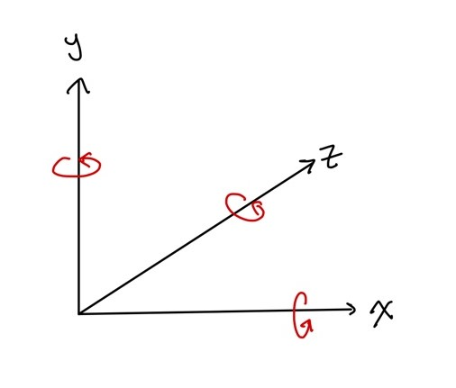

# 21/10/15 Unity 특강 2

주요 함수 소개, 프로젝트 환경 설정, 에셋 스토어/예제 프로젝트 공유

## 0. 프로젝트 셋팅

프로젝트를 만들기 위해 새로운 프로젝틀를 만들어 준다. 이때, **프로젝트 파일의 경로와 이름은 무조건 영문 혹은 숫자만 사용한다.**


## 1. Asset Store

프로젝트를 구성하는 배경을 하나하나 만들기엔 시간이 오래걸리므로, 에셋을 사용하여 기본 구조를 만들어보도록 한다.


에셋 탭을 보면 다양한 카테고리가 있다. 3D 프로젝트로 생성해줬으므로 3D 카테고리로 들어간다.


하위 카테고리를 주변 환경으로 설정하고 정렬기준을 낮은 가격부터로 설정 했다. 무료 에셋만 보고 싶다면 오른쪽 카테고리의 아래에서 가격대를 설정해주면 된다.


Free 에셋이 되게 많은 것을 볼 수 있다. 마음에 드는 것을 하나 골라서 `내 에셋에 추가하기`버튼을 눌러준다.


이렇게 모달창이 뜨는데, Unity에서 열기로 눌러준다.


모달창이 뜨지 않았다면 네브바에서 내 에셋 버튼을 눌러주고 Unity에서 열기를 눌러준다.


자동으로 패키지 매니저가 뜨게 될 것이다. 이제 다운로드를 눌러준다. 그럼 다운로드가 import로 바뀌게 될 것이다. 다시 Import를 눌러준다.


가져오고 싶은 것만 누르면 되는데, 나는 전체 객체들을 기본 셋팅으로 눌러줄 것이기 때문에 몽땅 가져오기를 눌렀다.


(중간에 가져올 에셋을 바꿨음)

Import를 해주면 Project 레이어 창에 변화가 생긴다. `Assets` 폴더에 내가 다운받은 에셋이 저장되는 것이다. 여기서 Assets 바로 하위 폴더인 Scenes가 우리가 만든 프로젝트의 씬이다. 따라서 다운받은 에셋 폴더 내부에 있는 Scene에 들어가서, 씬 파일을 위의 Hierarchy에 드래그앤 드롭 해주면 위와 같이 열린다. 여기서 전체 선택(ctrl + a)을 해준뒤, 빼고 싶은 객체들을 빼준 뒤, 복사한 후 우리 프로젝트의 씬을 누르고 하이라키에서 붙여넣기 해준다.

(캐릭터의 경우는 fbx 파일을 찾아 하이라키 창으로 드래그해주면 된다.)

오른쪽의 Scene 뷰를 보면 가져온 에셋이 잘 적용되어 있음을 볼 수 있다.


Hierarchy에서 메인 카메라를 더블클릭하면 카메라가 있는 위치로 이동하게 된다. 위의 Scene에서는 카메라의 위치가 보인다. 아래 Game은 카메라의 시점에서 보는 모습이다.


## 2. Script 만들어보기

에셋에 코드를 입력해줘서 동작을 시키려면 Script를 만들어줘야한다. 예를 들면 사용자가 키보드의 방향키를 이용하여 캐릭터를 움직이고 싶다. 그럴때 사용하는 것이  script인 것이다. 유니티는 이 스크립트를 C#으로 짜게 된다.


좀 전에 불러온 배경 에셋에 캐릭터 에셋을 불러와줬다. 메인 카메라가 중간에 사라져서 맞추느라 애먹었다ㅠㅠ

(여담이지만, 좀비 에셋 다운 받았다가 너무 리얼해서 귀여운 걸로 다시 다운...ㅠ)

이제 사용자가 마우스로 시선을 조정할 수 있도록 해보려고 한다. 즉, 사용자가 저 캐릭터일 때 키보드로 이동도 해보고, 시선을 돌리며 다른 곳도 가볼 수 있도록 설정하는 것이다.

본격적으로 스크립트를 작성하기 전에, 유니티의 컴파일은 Play버튼이다. 상단에 있는 재생 버튼을 누르면 run이 되는데, play가 되면 객체에 담긴 애니메이션이 동작하기도 하고, 스크립트를 토대로 마우스나 키보드로 동작도 가능하게 된다.

이 개념을 사용해서 캐릭터를 이동시켜보도록 하겠다.


---


### 01 - 개발 테스트(기본 셋팅)

우선 유니티에서 개발을 할때 위와 같이 에셋을 전부 올려놓고 하는 경우도 있지만,  이 경우에는 에셋들을 교체할 때 스크립트를 다시 바꾸고 하는 과정이 번거로울 수 있다. 따라서 처음에는 그냥 Scenes를 켠다(처음 유니티를 켜면 나오는 secne 맞다.)


이런 씬이 나올 것이다. 이제 여기서 개발 테스트를 어떻게 하는지 살펴보도록 할 것이다.

보통 개발을 처음 할 때 바로 에셋을 가져오지 않는다. 기능들이 잘 작동하는지 먼저 구현을 해보는 것이다. 하이라키 창에서 3D 오브젝트들을가져온다. 우선 Plane을 가져와서 그라운드(바닥)를 만들어준다.


그럼 이렇게 땅이 생기게 된다. 새로 만든 plane은 보통 하얀색이 되어있는데, 이것이 plane의 Default Material이다. 즉, 기본적으로 흰색이 나오는 것이다.

기본색을 바꿔보자. 프로젝트 레이어의 `Assets`폴더 안에 `Materials` 폴더를 만든다. 차후 Material, Scripts, Objects 등 모든 구성 파일들을 폴더로 구분해서 사용하는 것이 좋다.

폴더에 들어가서 마우스 우클릭 후, Create의 Material을 눌러주면 새로운 재질 파일이 뜨게 된다.


어떤 객체의 재질인지 이름을 구분해서 지어주고, 옆의 Inspector의 Albedo에서 색을 정해준다. 완성된 매테리얼 파일을 하이라키의 객체로 드래그해주면 자동으로 적용이 되게 된다.


### 02 - 오브젝트 위치/크기 변경하기

플레이어를 만들어보도록 한다. 간단하게 캡슐 객체를 새로 만들어준다. 이때, 처음 3D 오브젝트들을 불러오면 위치가 재각각이 된다. 따라서 인스펙터의 Pisition에서 객체들의 위치를 (0, 0, 0)으로 설정해줬다.


이렇게 두 오브젝트를 (0, 0, 0)으로 설정하니 겹치게 된다. 캡슐을 위로 올리는 방법은 두가지가 있다.

1. 왼쪽 상단에 방향 버튼(Move Tool, 단축키 W)를 누르고 캡슐의 Y축을 올려주는 방법
2. 인스펙터의 포지션에서 Y축 값을 변경하는 방법.

캡슐의 Scale(크기)이 1이므로 y값을 1로 변경했다.


### 03 - 스크립트 만들어 적용하기_카메라 움직이기

스크립트도 폴더를 만들어 관리해주는 것이 좋다. Scripts 폴더에 들어가면 마우스 우클릭하고 Create의 C# Script를 눌러준다. 

카메라를 움직이는 스크립트이므로 `CamMoving`라고 이름을 붙여줬다. 새로만든 스크립트를 더블클릭하면 비쥬얼 스튜디오가 켜지면서 파일이 열리게 된다.

> 만약, 비쥬얼 스튜디오가 아니라 메모장이나 다른 프로그램이 켜진다면 `Edit - Preferences - External Tools`에서 External Script Editor을 Visual Studio로 설정해주면 된다.
>
> 


 

**이때, 만든 스크립트의 이름과 위 스크립트 객체의 이름이 동일해야한다**. 만약 스크립트 파일명을 변경하면 위의 class 이름도 변경해줘야하는 것이다.

간단히 위의 함수들에 대해서 설명해보자면,

- Start(): Train이 첫번째로 업데이트 되었을 때 호출되는 함수
- Update(): Train이 실시간으로 계속해서 받아오는 함수

이다. 카메라를 움직이려면 마우스 입력을 받아 물체를 회전시키는 것이므로 Update에 적어줄 것이다.


여기서 유니티의 특징이 나타난다. 보통 코드를 작성하고 컴파일을 하면, 코드를 작성한 프로그램 내에서 동작이 된다(ex. python 코드를 작성하면 Run은 pyCharm이나 VScode에서 실행). 하지만 유니티는 에디터인 Visual Studio와 긴밀하게 연결되어 있다. 즉, 유니티와 비쥬얼 스튜디오를 오가면서 코드를 작성하고 실행시켜야한다는 것이다.

이제 코드에 대한 설명이다.


#### 01) Mouse X, Mouse Y

Edit의 Project Settings에 가면, input Manager를 볼 수 있다. 이것은 input 값을 받아올 때, 어떤 키를 매핑해줄 것인지 관리해주는 기능이다.  `Axes` 를 눌러 열어보면, Axes의 이름들이 나와있다.

 

스크립트를 작성해봤다면 `Mouse X`가 눈에 익을 것이다. 이것을 자세히 살펴보자.


상세히 살펴보면 `Mouse Movement`라고 되어 있고, 마우스가 움직이는 X축의 값을 가져온다는 것을 짐작할 수 있을 것이다. 당연히 Y는 Y축을 기준으로 마우스의 움직이는 값을 받아오는 것이라 짐작할 수 있다.

Input Manager의 Mouse input을 가져오라는 코드가 바로

```c#
float mouse_X = Input.GetAxis("Mouse X");
float mouse_Y = Input.GetAxis("Mouse Y");
```

이게 되는 것이다.

Axis축 값을 가져오는데, 그 중에서 Mous X, Mouse Y의 값을 가져오는 것이다.

**이때, GetAxis 뒤에서 가져오는 값은 위의 Project Input Manager와 동일한 이름을 적어줘야한다.**


#### 02) Vector3(x, y, z)

마우스 값을 입력을 받았으니, 방향을 결정해줘야한다. 유니티 상에서는 벡터라는 개념이 나온다. 마우스 입력값을 이용해서 회전 값을 결정해야하는 것이다.

다행히 우리가 직접 벡터 값을 구할 필요는 없다. `Vector`를 입력하면 자동으로 여러 함수들이 뜰 것이다. 자세히 보면 뒤에 숫자들이 나와있다. 이것은 벡터의 차원을 뜻한다. 우리가 사용하는 것은 3차원 공간이므로 Vector3를 이용한다.

```c#
Vector3 dir = new Vector3(-mouse_Y, mouse_X, 0);
```

vector3 변수 dir(direction)이라는 변수에 3차원 벡터의 좌표값을 넣어준다는 뜻이다.

이때, 좌표값이므로, new Vector3 뒤에는 (x, y, z)의 값이 따라와야한다. 그런데 왜 x축에 -Y가 들어가고, y축에 X가 들어가는가?


우리가 마우스로 움직일 메인 카메라는 바로 저것이다. 상단의 Rotate Tool을 눌러 방향을 바꿔보면서 인스펙터의 Rotation값을 살펴보자. x축을 가로로 움직여보면, 오른쪽으로 움직일 때, Y의 Rotation값이 음수로 변하고 왼쪽으로 움직일 때 양수로 변하는 것을 확인할 수 있다. 위아래로 움직여보면 아래로 움직일 때, X Rotation값이 음수가 되고 위로 움직이면 양수가 되는 것을 볼 수 있다.

3차원의 공간이기 때문이다. 아래의 그림을 살펴보자.



유니티의 3차원 공간을 좌표로 표시하면 위와 같다. 이때 각 축이 회전을 한다고 생각해보자. 몸을 기준으로 X축을 위의 그림처럼 회전한다고 하면 어떤 변화가 생기겠는가? 위아래로 움직이게 되는 것이다. 즉, 고개를 끄덕이는 현상이 나타나게 된다. 앙페르의 오른나사 법칙과 같은 형식으로 물리적 생각을 대입해보면, 반시계방향으로 회전하는 것을 기준으로 고개를 아래로 내리면 -, 위로 올리면 +의 값을 가지게 될 것이다.

마찬가지로 Y축을 회전해보면, 고개를 좌우로 돌리는 변화가 생긴다. 이때도 역시 반시계 방향이 기준이므로 왼쪽으로 고개를 돌리면 +, 오른쪽으로 돌리면 -가 된다.

그렇다면 Z축은? 고개를 양옆으로 스트레칭 하듯이 갸웃하게 된다.


이런 이유로 Vector3의 뒤에는 위와 같은 코드가 들어가게 되는 것이다.


#### 03) transform

이제 회전 방향을 결정했으니, 회전 방향으로 물체를 회전 시켜야한다. 벡터에서는 방향과 동시에 속도가 필요하다. 다시말해 물체를 회전하기 위해선 방향과 함께 속도도 필요하게 된다. 이를 위해서 위에서 속도 변수를 정해준다(모든 프로그래밍 언어는 위에서 아래로 내려오므로, 변수를 미리 설정하는 것이 좋다.)

```c#
public float rotSpeed = 200f; //실수형 변수이므로 f가 들어감.

void Update()
{
    ...
    
    transform.eulerAngles += dir * rotSpeed * Time.deltaTime;
        
    ...
}
```

transform에는 `rotation`뿐만 아니라, `position`, `eulerAngles`도 들어갈 수 있다. 모두 인스펙터의 값을 받아주는 것이다. 우리는 각도를 바꿔주는게 될 것이므로 eulerAngles를 사용한다. 위에서 받아온 방향값 dir과 전역 변수로 설정한 rotSpeed, 그리고 deltaTime을 곱해준 값을 **누적해주는 것이다.**

여기서 마우스의 좌표는 Game 화면 기준이다. Game화면 창에서 `Maximize On Play`버튼을 누르면 플레이를 눌렀을 때 화면이 최대화 된다. 참고로 play의 단축키는 `Ctrl + P`이다.

deltaTime은 프레임을 정규화 시켜주는 것으로 어떤 프레임이든 상관 없이 일정한 속도로 곱해주는 것이다. 즉 현재 시간이 frame time이 되게 해주는 것이다.


> 최종 스크립트
>
> ```c#
> using System.Collections;
> using System.Collections.Generic;
> using UnityEngine;
> 
> public class CamMoving : MonoBehaviour
> {
>     public float rotSpeed = 200f;   // 실수형 변수이므로 f가 들어감.
>     void Start(){}
>     void Update()
>     {
>         // 마우스 입력 -> 물체 회전하는 함수
>         float mouse_X = Input.GetAxis("Mouse X");  // mouse_X 변수에 마우스 X축의 값을 받아 저장해준다.
>         float mouse_Y = Input.GetAxis("Mouse Y");
>         // 회전 방향 결정하기
>         Vector3 dir = new Vector3(-mouse_Y, mouse_X, 0);
>         // 회전 방향으로 물체를 회전
>         transform.eulerAngles += dir * rotSpeed * Time.deltaTime;
>     }
> }
> ```


#### 04) 스크립트 적용하기

그럼 이렇게 완성한 스크립트를 대체 오브젝트에 어떻게 적용할 것인가? 유니티에서는 오브젝트에 속성들을 붙일 수 있다. 플레이어 객체를 눌러보자. 그럼 인스펙터에 해당 오브젝트가 가진 속성들이 뜨게 된다. 여기에 속성 값으로 스트립트를 넣을 수 있다.

즉, 이 오브젝트가 원하는 스크립트로 움직이게 하는 것이다.


스크립트를 드래그 해서 추가해주면,


속성에 스크립트가 추가된 것을 확인할 수 있다. 지울때는 CamMoving(Script)라고 적힌 부분에서 마우스 우클릭을 하고 Remove Component를 눌러주면 된다.

카메라를 움직이게 할 것이므로 player에서 위의 컴포넌트를 지우고 다시 메인카메라 오브젝트에서 똑같이 반복해준다.

play 버튼을 누르고 Game화면으로 돌아오면 마우스를 따라 시선이 바뀌는 것을 확인할 수 있다.


---


카메라가 잘 작동하고 있지만 사실 지금의 카메라 움직임에 어색함을 느낄 것이다. 고개가 무한으로 360도 돌아가지 않기 때문이다. 그래서 뒤집히기도 하고, 이상한 곳이 보이고 자제가 되지 않는 것이다. 이런 점을 보안하기 위해 각도에 제한을 둘 것이다.

즉, X축 회전 값을 -90 ~ 90도 사이로 제한해준다.

```c#
Vector3 rot = transform.eulerAngles;
rot.x = Mathf.Clamp(rot.x, -90f, 90f);
transform.eulerAngles = rot;
```

이렇게 간단하게 -90~ 90도로 제한을 해줬다.

더 정교하게 변경하고 싶다면 오픈 소스가 많이 있으니 참고하면 된다. `Unity cam rotate`를 검색해서 참고했다. [유니티 공식 사이트](https://docs.unity3d.com/Manual/) 에서도 많은 설명이 있으니 참고하면 좋을 것이다.


### 04 - 스크립트 만들어 적용하기_캐릭터 움직이기

이번엔 캐릭터를 움직이는 무브먼트를 적용해보도록 한다. 캐릭터가 이동하는 스크립트를 만들 것이다.

```c#
using System.Collections;
using System.Collections.Generic;
using UnityEngine;

public class PlayerMoving : MonoBehaviour
{
    public float moveSpeed = 7f;
    void Start(){}
    void Update()
    {
        float h = Input.GetAxis("Horizontal");
        float v = Input.GetAxis("Vertical");

        Vector3 dir = new Vector3(h, 0, v);
        dir = dir.normalized;  // 정규화(산란 되어 있는 값들을 정규화 시켜줌)
        transform.position += dir * moveSpeed * Time.deltaTime;
    }
}
```

우선 결론적으로 최종 코드이다. 카메라를 움직이던 스크립트와 비슷함을 확인할 수 있을 것이다. 이제 코드의 특징들만 하나하나 살펴보도록 한다.

#### 01) Horizontal / Vertical 


이번에 사용한 인풋 매니저는 이것이다. 이름에서 알 수 있듯이 수평 움직임을 뜻한다. 중간에 보면 Nagative button 은 왼쪽, Positive는 오른쪽임을 알 수 있다. 키보드의 왼쪽 방향키를 누르면 음수가, 오른쪽 방향키를 누르면 양수가 들어가게 되는 것이다. 바로 밑의`Alt Button`은 보조키로서 게임할 때 자주 쓰는 A, S, D, F가 된다. 즉, a를 누르면 왼쪽, d를 누르면 오른쪽 보조키가 작동된다.

같은 방식으로 Vertical 역시 수직적으로 동일한 작동을 하는 것을 볼 수 있다.

또, 보조키는 우리가 자유롭게 변경할 수 있다.


#### 02) Vector3

방향키를 입력 받았으면 이동 방향을 설정해줘야한다.

```c#
Vector3 dir = new Vector3(h, 0, v);
```

여기서도 수학적인 개념이 들어가게 된다. 이전의 [3축](#02-Vector3(x, y, z))을 기억하는가? 우리가 수평으로 움직이게 되면 X축을 기반으로 좌우로만 이동하게 된다. +로 갈때는 오른쪽, -로 갈때는 왼쪽. 하지만 수직으로 이동할 때는 앞으로 이동하게 될 것이고, 이로써 Z축으로 가게 되는 것이다. Y축은 점프가 된다. 따라서 좌표가 `(h, 0, v)`가 되는 것이다.


#### 03) transform.position

`transform.position`은 이 스크랩트가 담겨있는 오브젝트의 위치이다. 여기에 이동 값들을 누적해줘야한다.

```c#
transform.position += dir * moveSpeed * Time.deltaTime;
```

따라서 이렇게 방향*속도를 누적해주면 위와 같은 코드가 작성된다. 


이제 완성된 스크립트를 오브젝트에 드래그하여 적용시켜준다. 잘 움직이는 것을 확인할 수 있다!


## 3. 무빙 심화 스크립트

```c#
using System.Collections;
using System.Collections.Generic;
using UnityEngine;

public class PlayerMoveAd : MonoBehaviour
{
    public float moveSpeed = 7f;
    CharacterController cc;  // 캐릭터 콘트롤러 변수

    float gravity = -30f;    // 중력변수
    float yVelocity = 0;     // 수직 속력 변수

    public float jumpPower = 10f;   // 점프력 변수
    public bool isJumping = false;  // 점프 상태 변수

    void Start()
    {
        cc = GetComponent<CharacterController>();   // 스크립트가 시작되면 초기에 컨트롤러를 불러옴
    }

    void Update()
    {
        float h = Input.GetAxis("Horizontal");  // x축
        float v = Input.GetAxis("Vertical");    // z축

        Vector3 dir = new Vector3(h, 0, v);
        dir = dir.normalized;

        // 메인 카메라를 기준으로 방향 전환
        dir = Camera.main.transform.TransformDirection(dir);

        transform.position += dir * moveSpeed * Time.deltaTime;
        
        // 점프 중에 다시 바닥에 착지했다면,
        if (isJumping && cc.collisionFlags == CollisionFlags.Below)
        {
            isJumping = false;
            yVelocity = 0;
        }

        // 점프를 하지 않은 상태에서 키보드 스페이스 바를 입력했을 때,
        if (Input.GetButtonDown("Jump") && !isJumping)
        {
            // 캐릭터의 수직 속도에 점프력을 적용하고 점프 상태로 변경해줌
            yVelocity = jumpPower;
            isJumping = true;
        }

        // 캐릭터 수직 속도에 중력 값 적용
        yVelocity += gravity + Time.deltaTime;
        dir.y = yVelocity;
        cc.Move(dir * moveSpeed * Time.deltaTime);
    }
}
```

위에서 작성했던 스크립트는 단순히 캐릭터를 평면위에서 움직이게만 만들었다면, 이 스크립트는 점프 동작도 가능하게 했다.

이를 위해서 우선 캐릭터 콘트롤러 변수를  추가해줬다. 이것은 플레이어 오브젝트를 눌렀을 때, 인스펙터에 보이는 `Character Controller`이라는 속성으로 캐릭터의 물리적인 속성 값을 담당해준다. 


따라서 이 속성으로 캐릭터는 걸어다니거나 물체에 부딫히는 등의 세부적인 동작이 가능해지는 것이다.

전역 변수로 cc를 만든 것을 스크립트가 시작됨과 동시에 속성을 가져오도록 Start 함수에 get을 넣어주었다.

점프 효과를 위해 중력 효과도 넣어준다.


> [참고] public
>
> 스크립트 코드를 보면 어떤 변수에는 public이 붙어있고, 어떤 것은 붙어있지 않은 것을 볼 수 있다. 이 둘의 차이는 유니티 엔진에서 변경이 되는가의 차이이다. public 변수로 설정해주면 유니티 엔진의 인스펙터 창에서 해당 스크립트 속성에 들어가면 변경 창이 뜨게 된다.
>
> 
>
> 여기서 값을 변경해주면 스크립트에서도 적용이 되는 것이다. 반대로 public이 붙어있지 않은 변수들은 스크립트 내부에서만 변경이 되며 유니티 엔진에서 변경할 수 없다.


```c#
dir = Camera.main.transform.TransformDirection(dir);
```

여기서 위의 코드를 통해 카메라를 일인칭 시점으로 돌려준다. 일인칭 시점으로 카메라가 같이 움직이게 해주는 것이다.

나머지는 코드만 읽어도 유추할 수 있으므로 설명을 생략하도록 하겠다.


---


위에서 만들었던 캡슐에다 적용을 시켜보도록 하겠다. 인스펙터 아래로 내려가서 `Add Component`를 눌러준 뒤,`Character Controller`를 검색해 추가해준다.

그리고 새 스크립트를 넣어준다.

이제 카메라를 일인칭 시점으로 바꿔줄 것이다. 하이라키 레이어에서 Player 객체를 누른뒤 마우스 우클릭, Create Empty를 눌러준다. 이름은 `CamPosition`으로 변경해준다. transform의 position도 바꿔준다. 그리고 새로운 스크립트인 `CamFollow`를 생성한다.

```c#
public class CamFollow : MonoBehaviour
{
    public Transform target;
    void Start(){}

    void Update()
    {
        // 카메라의 위치를 목표 트랜스폼의 위치에 일치
        transform.position = target.position;
    }
}
```

오브젝트의 위치를 타겟 위치로 변경을 해주겠다는 코드가 된다. 그리고 이 스크립트를 메인 카메라에 드래그 해준다. 그럼 public으로 설정한 타겟을 인스펙터에서 설정할 수 있게 되는 것이다. 이제 이 타겟을 cam position으로 설정해준다. 해당 오브젝트를 타겟 드롭바에 드래그앤 드롭 해주면 된다. 그럼 이제 타겟 포지션은 메인 카메라의 위치가 되는 것이며, 캠 포지션은 플레이어 객체에 상속시켜줬으므로 최종적으론 일인칭 시점이 되는 것이다. 실행해보면 일인칭으로 바뀐 것을 확인할 수 있다.


> [참고] 카메라 시점 변경
>
> 일인칭으로 하다가 특정 버튼을 누르면 3인칭으로 바뀌는 것도 물론 가능하다. 새로운 카메라 오브젝트를 불러와주면 된다.
>
> 
>
> 그럼 새로운 카메라는 이렇게 태그 버튼이 생기게 되는데, 여기서 새로운 태그 이름(이를테면 Sub Camera)를 만들어 설정해주고, 스크립트를 사용하여 특정 키를 누르면 이 태그를 찾아 바뀌게 하는 것이다. 태그를 찾는 것은 Unity tag find 등의 검색을 통해 찾을 수 있다.


## 4. Scene 이동 버튼

이번엔 메인 화면에서 버튼을 누르면 다른 씬으로 이동하는 동작을 만들어보도록 하자. 버튼을 만들려면 캔버스가 필요하다. 하이라키 레이어에서 우클릭, UI에 들어가서 Canvas를 눌러준다. 그리고 같은 경로로 캔버스의 하위 객체로 버튼을 만들어준다.

버튼을 열어보면 Text가 들어있다. 여기서 내부에 들어가는 글자를 변경해줄 수 있다.


이제 스크립트를 하나 만들어준다. ChangeScene으로 이름 지었다. 이번에는 스크립트의 위에서 네임 스페이스를 하나 추가해준다.

```c#
using UnityEngine.SceneManagement;
```

씬을 관리해주는 라이브러리라고 볼 수 있겠다.

이제 씬을 교환해주는 코드를 작성한다. 매우 간단하다.

```c#
public void changeScene(string SceneName)
{
    SceneManager.LoadScene(SceneName, LoadSceneMode.Single);
}
```

다른것은 손대지 말고 밑에 새로운 퍼블릭 함수를 만들어주는 것이다. 이제 씬매니저가 알아서 새로운 싱글 씬을 불러올 것이다.


다시 유니티엔진으로 돌아와서 하이라키를 보면, 아까 canvas를 만들면서 자동으로 생성된 이벤트 시스템 오브젝트가 보일 것이다. 이것을 클릭해주고 아까 작성한 change Scene 스크립트를 여기에 적용시켜준다.

그리고 버튼을 눌러 인스펙터를 열면 `On Click()` 속성이 보일 것이다. 처음 불러올 땐 List is Empty로 비어있는 것을 볼 수 있다. 여기서 +를 눌러서 이벤트 시스템 오브젝트를 추가해줄 것이다.


그리고 Function을 입력해주는데, 우리가 스크립트에서 만들었던 Func이 생긴 것을 볼 수 있다.


이제 빈칸이 생겼다. 스크립트에서 스트링으로 scene 이름을 넣어주도록 설정했기 때문이다. 따라서 이제 넘어갈 씬의 이름을 넣어준다.


이제 재생을 하고 눌러보면 넘어가는 것을 확인할 수 있다.